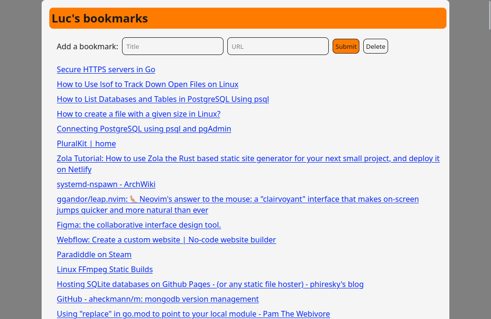

# rimi

My idea is to create a bookmark manager that is self-hosteable and single-user only.

Why? I am constantly roaming between devices, and for reasons, I can't use the same web browser on all devices (Sync isn't an option).

Often it happens that I need to recall to articles that I read, or documentation websites, and I am lazy to go thro the search engine all over again.

This program allows me to deploy an auth-only website that I can safely access on any device I own to search thro my bookmarks or add more.

# Compiling and setup

You need the Go programming language - [read this](https://golang.org/doc/install)

**Optimization note**: Since Go 1.18, if you are using an x86_64 CPU you can setup the environment variable `GOAMD64`

You can found a detailed description [here](https://github.com/golang/go/wiki/MinimumRequirements#amd64)

***TL;DR:** Use v1 for any x64 cpu, v2 for circa 2009 "Nehalem and Jaguar", v3 for circa 2015 "Haswell and Excavator" and v4 for AVX-512.*

**Example:** `export GOAMD64=v2`

Use the make command for building the binary

	make

Run the service specing which host and port to run.
For this program in particular, I recommend running on local network interfaces or a mesh network with encryptation like [Tailscale](https://tailscale.com/kb/1151/what-is-tailscale/).

You can also customize the title of the application by changing the environment variable "TITLE".
	
	BIND=127.0.0.1 PORT=5050 TITLE="Emily's bookmarks" ./rimi

You can use this example [user systemd unit](https://wiki.archlinux.org/title/systemd/User) if you wanna keep it running:

	[Unit]
	Description=rimi bookmark manager

	[Service]
	WorkingDirectory=/home/user/rimi
	Environment=TITLE="Emily's bookmarks"
	Environment=PORT=5050
	Environment=BIND=127.0.0.1
	ExecStart=/home/user/rimi/rimi

	[Install]
	WantedBy=default.target

# Import bookmarks from a web browser

I only tested this with Mozilla Firefox, might work with Chromium but I am not sure.

You need [Deno](https://deno.land/) to run the script.

Use your web browser to export your bookmarks into a bookmarks.html file and place it in this same directory.

Run this command:

	deno run -A --unstable convertBookmarksHTMLtoJSON.ts

# Disclaimer

This program is a work in progress and it's not done.

I made this program for myself, I don't have the intention (for now) to document it and/or give support, so pretty much you are on your own.

This piece of software is barely tested, don't use it on production, or use it on your own risk.
